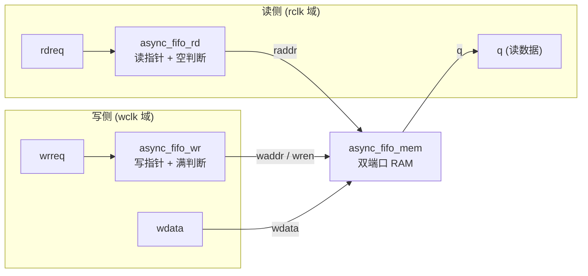
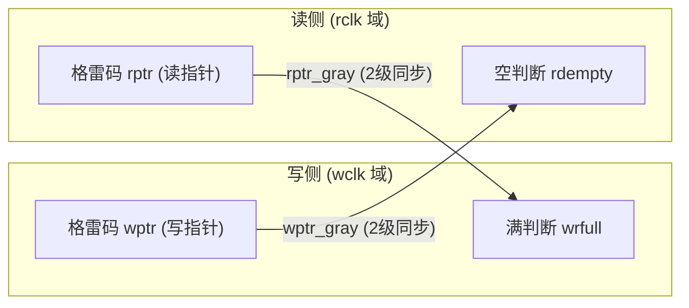

# 设计结构
## 数据通路

## 指针通路

# 技术要点
- 双端口RAM：
	1. reg [7:0] mem [255:0]
	2. 调用IP核（移植性差）
- bin -> gray
```verilog
	assign gray_ptr = bin_ptr ^ (bin_ptr >> 1);
```
- gray -> bin
```verilog
	wire [AW:0] bin_sync;
    assign bin_sync[AW] = ptr_gray_sync[AW];// 同步后的另一侧指针
    genvar gi;
    generate
        for (gi = AW-1; gi >= 0; gi = gi - 1)
            assign bin_sync[gi] = bin_sync[gi+1] ^ ptr_gray_sync[gi];
    endgenerate
```
