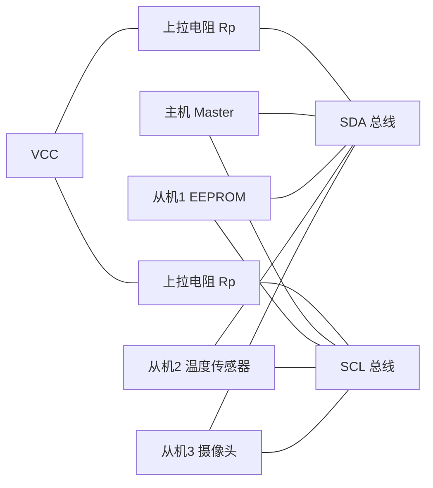

# I2C 概览

I2C（Inter-Integrated Circuit，集成电路间总线）由 Philips 公司于 1982 年推出，是一种**两线制、同步、半双工**的串行总线协议，用于连接同一块电路板上的多个低速外设。

## 为什么需要 I2C

- **引脚极少**：无论挂多少个设备，都只占 2 根线（SDA 数据 + SCL 时钟），对引脚紧张的 MCU/FPGA 非常友好；
- **总线共享**：多个设备挂在同一条总线上，通过**器件地址**寻址，不需要为每个外设单独接线；
- **多主多从**：支持多个主机，配合仲裁机制可安全共存。

## 基本特点

1. 两线制：SDA（串行数据线）+ SCL（串行时钟线）
2. 同步通信：时钟由主机产生，数据与时钟同步
3. 半双工：数据在同一根线上双向传输，同一时刻只能一个方向
4. 寻址机制：每个设备有独立的器件地址（7 位或 10 位）
5. 开漏 + 上拉：总线电平靠上拉电阻提供，天然支持"线与"与多主机仲裁
6. 带应答（ACK）：每传输一个字节，接收方回一个 ACK 位，传输可靠性比 SPI 高

## 传输速率

| 模式 | 速率 | 说明 |
| --- | --- | --- |
| 标准模式（Standard） | 100 kbit/s | 最常用，兼容性最好 |
| 快速模式（Fast） | 400 kbit/s | 大多数现代器件支持 |
| 快速模式+（Fast Plus） | 1 Mbit/s | 较少见 |
| 高速模式（High-speed） | 3.4 Mbit/s | 需额外电流源，很少用 |

## 总线拓扑

> 📌 待补图：I2C 总线硬件连接原理图（多从机 + 上拉电阻选值）

- **上拉电阻**：所有设备空闲时输出高阻，总线靠 Rp 拉高；Rp 取值需在速率与总线电容（<400pF）之间权衡，常用 4.7kΩ（100k）~ 1kΩ（400k）；
- **总线电容**：挂载设备越多、走线越长，总线电容越大，上升沿越缓，最高速率越低。

## 三协议对比（UART / SPI / I2C）

| | UART | SPI | I2C |
| --- | --- | --- | --- |
| 线数 | 2（TX/RX） | 4（SCK/MOSI/MISO/CS） | 2（SDA/SCL） |
| 同步方式 | 异步（约定波特率） | 同步 | 同步 |
| 双工 | 全双工 | 全双工 | 半双工 |
| 寻址 | 无（点对点） | 片选 CS | 器件地址 |
| 速率 | 低（≤几 Mbit/s） | 高（几十 MHz） | 中（≤3.4 Mbit/s） |
| 应答机制 | 无 | 无 | 有（ACK） |
| 典型用途 | 调试口、GPS、蓝牙 | Flash、ADC、LCD | EEPROM、传感器、RTC |

## 系列导读

- 物理层：电气特性（开漏、上拉、线与）→ [[I2C 物理层]]
- 协议层：起始/停止、字节传输、读写时序 → [[I2C 协议层]]
- 实现：Verilog 主机控制器 → [[I2C 实现]]
