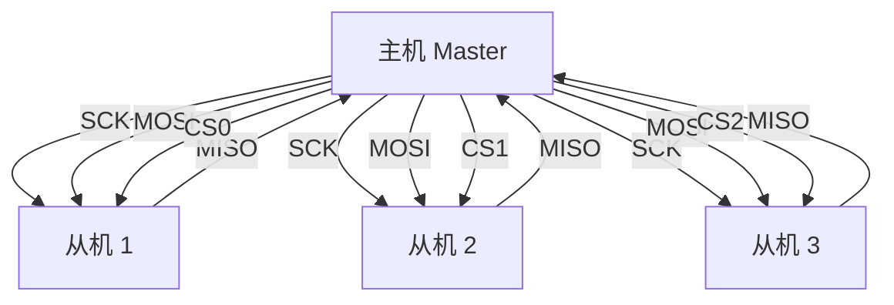
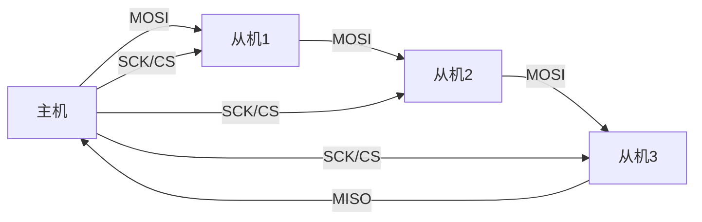

# SPI 物理层

SPI 的物理层很简单：**4 根单向信号线 + 推挽驱动**。相比 I2C 的开漏结构，SPI 的电气特性决定了它能跑出远高于 I2C 的速率。

## 引脚电气特性

| 信号 | 方向 | 电气特点 | 说明 |
| --- | --- | --- | --- |
| SCK | 主机 → 从机 | 推挽输出 | 时钟，由主机产生，决定传输速率 |
| MOSI | 主机 → 从机 | 推挽输出 | 主机发送的数据流 |
| MISO | 从机 → 主机 | 推挽输出 | 从机返回的数据流 |
| CS/SS | 主机 → 从机 | 推挽输出 | 片选，**低电平有效** |

- **推挽输出**：每个引脚由一个设备独占驱动，高低电平都是强驱动，边沿陡峭 → 速率可以很高（几十 MHz）；
- 对比 I2C 的开漏 + 上拉：不需要上拉电阻，也没有"线与"和仲裁，代价是**不支持多主机**；
- 电平通常是标准 TTL/CMOS（3.3V 或 5V），驱动能力与器件有关；
- **单向线**：MOSI 只发、MISO 只收，数据流向固定，所以同一时刻可以"一进一出"（全双工）。

## 片选信号 CS

- SPI 没有地址概念，主机用 **CS 片选**选中目标从机：拉低 CS → 该从机参与传输，拉高 → 从机忽略总线；
- 一个从机占一根 CS 线，**n 个从机共需 3 + n 根线**；
- 空闲时所有从机的 CS 都保持高电平。

## 一主多从拓扑

- SCK / MOSI / MISO 三根线**所有从机共享**，靠 CS 区分当前与主机通信的从机；
- **未被选中的从机必须把 MISO 置为高阻**，否则多个从机同时驱动 MISO 会短路——这是从机硬件必须遵守的规则；
- MISO 共享线没有上拉（推挽结构），空闲时电平不确定，仅在 CS 有效的传输期间有意义。

> 📌 待补图：FPGA 与 Flash/ADC 的 SPI 硬件连接原理图

## 菊花链（Daisy Chain）拓扑

对引脚特别紧张的场景，可以让多个从机串成一链：

- 所有从机共享一个 CS 和 SCK，数据像移位寄存器一样**逐级穿过**每个从机；
- 缺点：任一级故障整条链失效，且传输 n 个设备需要 n 倍时间。

> 📌 待补图：SPI 菊花链连接原理图

## 速率与距离

- SPI 没有协议规定的速率上限，实际取决于器件和布线；
- 板内走线可达数十 MHz；**距离越远速率越低**，跨板连接时 SCK 边沿劣化是主要瓶颈；
- 主从器件在 PCB 上应尽量靠近（见 [[SPI 概览]] 的附注）。
