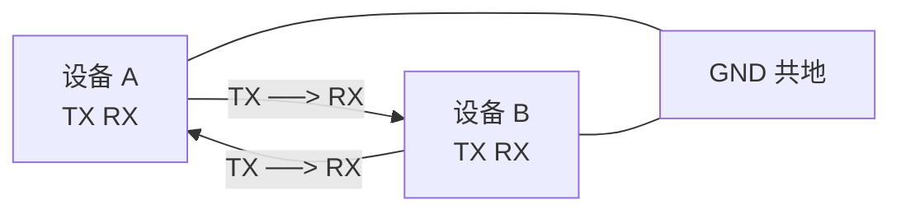

# UART 物理层

UART 只定义了**时序协议**，没有规定电气标准——"UART 电平"由物理层的具体收发器决定。同样一帧数据，在不同电平标准下以不同电压表示逻辑 0/1。

## 电平标准

| 标准 | 逻辑 0 | 逻辑 1 | 特点 | 典型场景 |
| --- | --- | --- | --- | --- |
| TTL/CMOS | 0V | 3.3V / 5V | 板内直连，距离 <1m | MCU ↔ 外设模块 |
| RS-232 | +3~+15V | -3~-15V | 逻辑**反相**，单端，抗干扰略强，点对点 | PC 老式串口（DB9） |
| RS-485 | 差分（A-B 极性） | 差分 | 差分传输，抗共模干扰，可多点组网，千米级 | 工业总线（Modbus） |

> 注意：**RS-232 的逻辑电平是反的**——正电压表示逻辑 0，负电压表示逻辑 1。FPGA/MCU 的 TTL 引脚不能直接连 RS-232 设备，中间必须经过 MAX3232 之类的电平转换芯片。

## 波特率（Baud Rate）

- **定义**：每秒传输的码元（bit）数，单位 bit/s；
- UART 是二进制调制，波特率 = 比特率；
- 收发双方**必须约定完全相同的波特率**，否则采样点逐位漂移，数据错乱；
- 常用值：9600、19200、38400、57600、**115200**（最常用）、230400、460800、921600；
- FPGA 实现时由系统时钟分频产生，波特率不是时钟频率的整数倍时会有误差（见协议层"16 倍过采样"一节）。

## 连接拓扑：点对点

UART 是点对点协议，一对设备之间交叉连接：

- **TX 接对方 RX**（交叉），**GND 必须共地**——没有共地就没有参考电平；
- 没有寻址、没有总线仲裁，只能一对一。

> 📌 待补图：USB 转串口模块（CH340/CP2102）与 FPGA 开发板连接原理图

## 与 FPGA 的连接

FPGA 引脚直接输出 TTL 电平的 UART 信号：

- **FPGA → 模块**：TX 引脚直连（电平匹配时）；
- **FPGA ↔ PC**：经 USB 转串口芯片（CH340、CP2102、FT232），芯片内部完成 USB ↔ TTL 转换；
- **电平不匹配时**（如 5V 模块配 3.3V FPGA）：需电平转换电路，注意 FPGA 引脚耐压。

## 传输距离与速率限制

- TTL 电平抗干扰弱，线缆过长时边沿劣化，一般控制在 **1 米以内**；
- 距离远（>1m）或环境嘈杂时应改用 RS-232 / RS-485 收发器，协议帧完全不变，只换物理层。
