# I2C 接口协议

## 1. 物理层

- **总线结构**：双线制 —— **SDA**（数据）和 **SCL**（时钟），支持多主机/多从机。
- **电气特性**：SDA/SCL 均为**开漏输出**，高电平由外部上拉电阻提供。
  - 避免总线短路（无设备主动推高）
  - 实现“线与”：任一设备拉低即总线低，全部释放才为高
  - 支持多主机仲裁
  - 电平兼容（3.3V/5V 可共存）
- **速率模式**：标准 100 kbit/s · 快速 400 kbit/s · 高速 3.4 Mbit/s
- **负载限制**：总线电容 ≤ 400 pF（决定最大挂载数量）

> **原理图**  
> 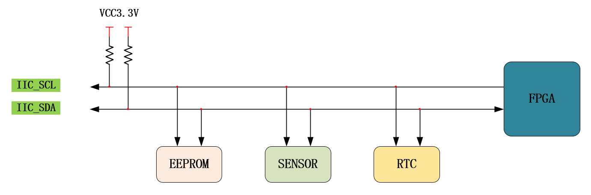

---

## 2. 协议层（时序）

时序分为四个阶段：

| 阶段         | SCL      | SDA                              | 说明                       |
| ------------ | -------- | -------------------------------- | -------------------------- |
| **空闲**     | 高       | 高                               | 总线未被占用               |
| **起始 (S)** | 高       | **下降沿**                       | 启动传输，所有设备退出空闲 |
| **数据读写** | 时钟脉冲 | 按位传输（MSB first，8 位/字节） | 每位在 SCL 高电平期间有效  |
| **停止 (P)** | 高       | **上升沿**                       | 结束传输，总线恢复空闲     |

> **时序图**  
> 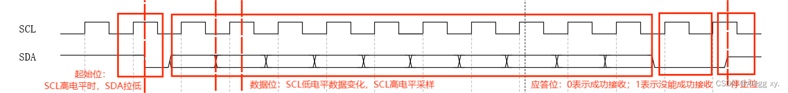

---

## 3. 设备地址与控制字节

- **器件地址**：通常 7 位，出厂固定（部分设备低几位可由硬件引脚配置，如 EEPROM）。
- **控制字节**（主机发送的第一个字节）：
  - 高 7 位 = 器件地址
  - 最低位 = **读写位**（0 = 写，1 = 读）

---

## 4. 读写操作（重点）

### 4.1 写操作

**单字节写入**（1 字节或 2 字节存储地址）  
流程图（以 2 字节地址为例）：
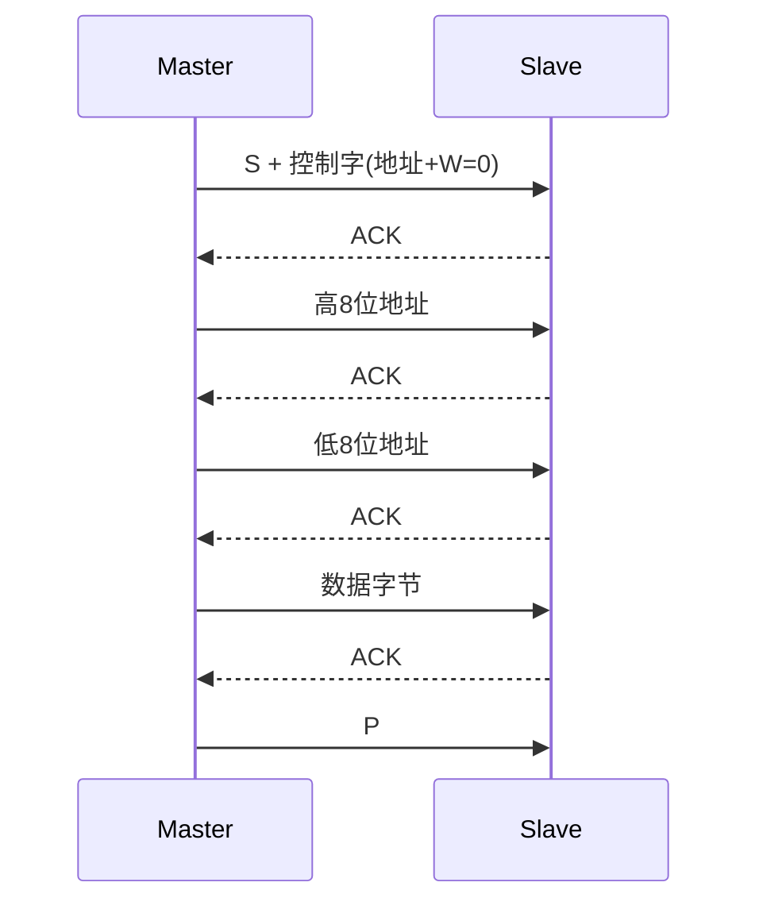

**页写入**（连续多字节，地址自动递增）  
- 流程与单字节类似，只是在数据阶段连续发送 N 个数据字节，每字节后从机回复 ACK。
- **注意**：一次页写入的字节数不能超过设备内部页大小。

> 图示：单字节写入（1字节地址 / 2字节地址）  
> 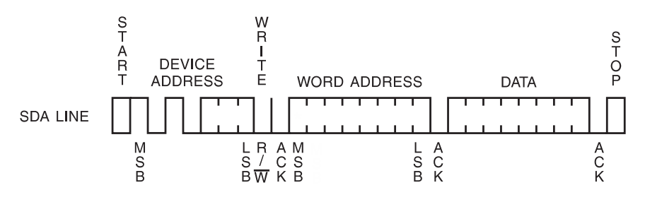 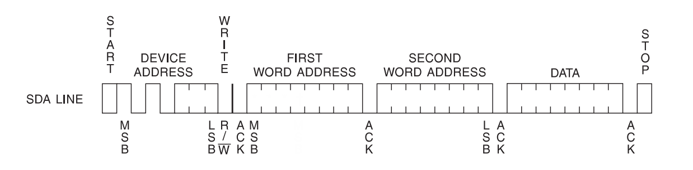  
> 图示：页写入（1字节地址 / 2字节地址）  
> 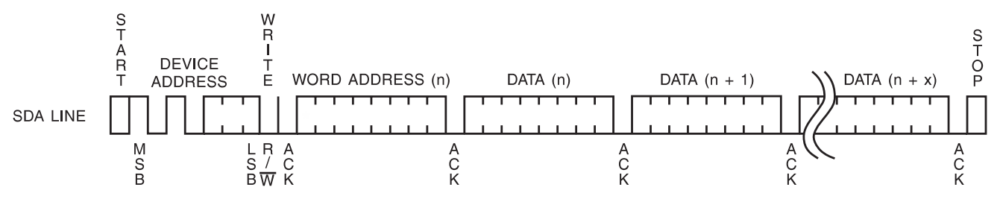 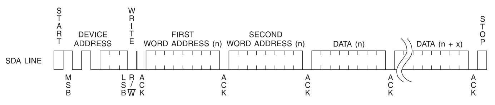

---

### 4.2 随机读操作

**原理**：先“虚拟写入”目标地址（不发送停止），再 **重启 (Sr)** 并切换为读模式，然后从机发送数据。

流程图（2 字节地址）：
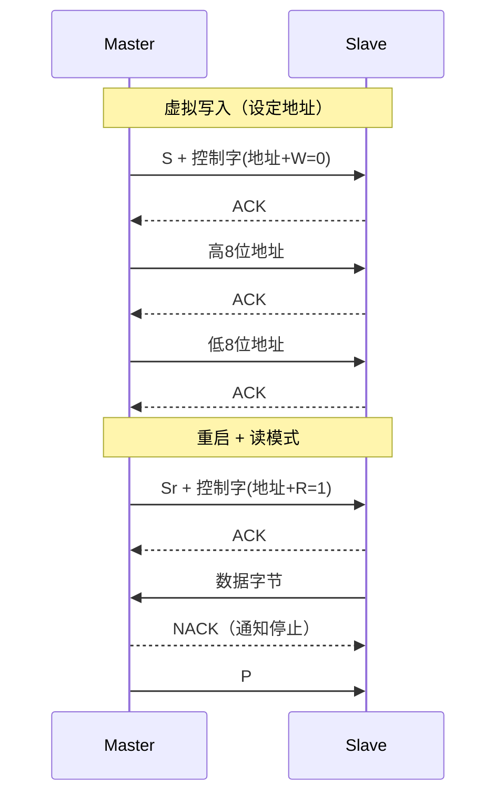

- **重启条件 (Sr)**：不发送停止，直接产生新的起始信号，继续占用总线。

> 图示：随机读（1字节地址 / 2字节地址）  
> 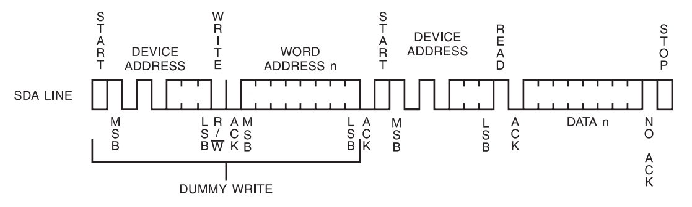 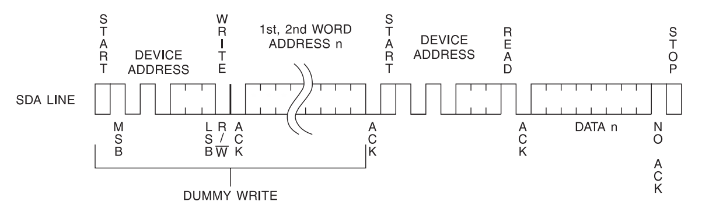

---

### 4.3 顺序读操作

- 与随机读类似，但在读取阶段，**前 N‑1 个字节主机回复 ACK**（要求从机继续发送），**最后一个字节回复 NACK** 后发送停止。
- 适用于连续寄存器或存储单元批量读取。

流程图（2 字节地址）：
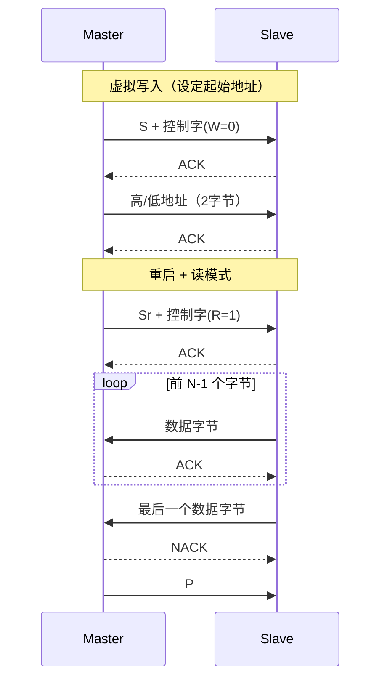

> 图示：顺序读（1字节地址 / 2字节地址）  
> 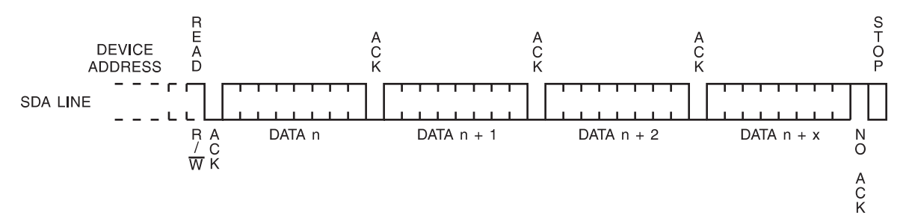 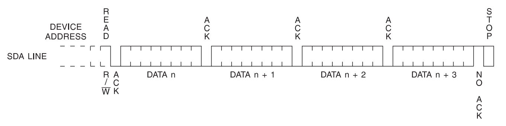

---

## 5. Verilog 主机实现（两级状态机）

- **设计要点**：
  - **主状态机**：IDLE → START → WRITE/READ → ACK → STOP
  - **位状态机**：生成精确的 SCL 时钟沿，控制 SDA 数据收发
  - 时钟分频参数 `CNT_MAX` 根据 `I2C_FREQ` 和系统时钟自动计算
  - 支持单字节写/读，可扩展为多字节（需外部控制循环）

> 核心代码见原笔记（此处略）

---

## 附录：常见问题速记

| 问题                    | 回答                                                     |
| ----------------------- | -------------------------------------------------------- |
| 为什么用开漏输出？      | 避免总线短路，实现线与，支持多主机仲裁。                 |
| 起始/停止条件何时采样？ | **SCL 高**时检测 SDA 边沿（下降沿=起始，上升沿=停止）。  |
| 数据何时有效？          | SCL 高电平期间 SDA 必须稳定；SCL 低电平期间 SDA 可变化。 |
| 应答（ACK）如何判断？   | 每个字节后的第 9 个时钟，从机拉低 SDA 表示应答。         |
| 随机读为什么需要重启？  | 先写地址再切换读方向，不释放总线，避免其他主机抢占。     |
| 顺序读如何结束？        | 主机回复 NACK 并发送停止，从机停止发送。                 |